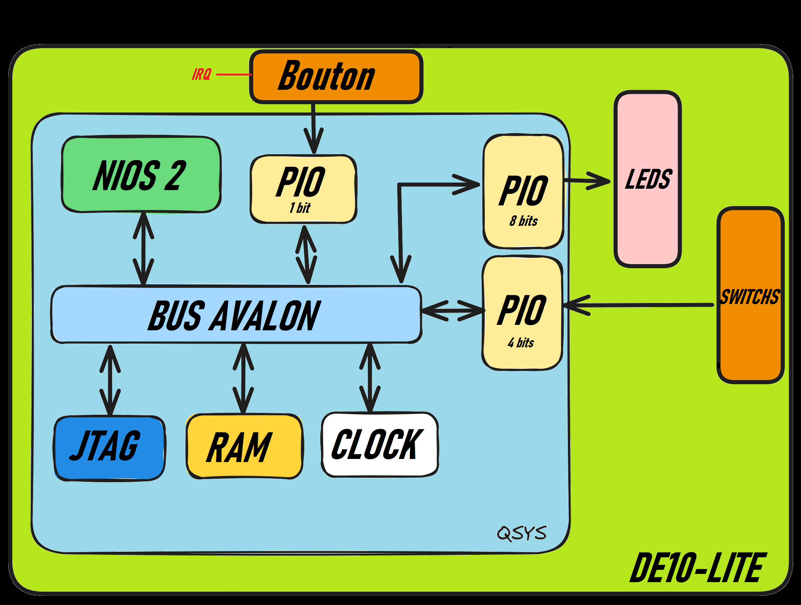

# albouquet_lab1

## Introduction

Le lab1 est un projet VHDL couplé au Softcore NIOS2.
Il a pour but de réaliser un chenillard à leds grâce à la carte DE10-lite.
Un programme en .c permet de gérer les périphériques (leds, boutons, switch) et le timer.

La méthode sans polling utilise le gestionnaire des interruptions du Nios2.

## Partie VHDL : 
* Un processeur NIOS II, une mémoire (40K octets), et un peripherique JTAG sont ajoutés.
* Trois IP PIO (1 bit, 4 bits, 8 bits) sont ajoutés pour controler les leds, le trigger et la vitesse.
* L'IP PIO "trigger" (bouton d'activation) est relié au controleur d'interruption (IRQ).

## Partie programme C : 

Il permet de gerer la fonction principale pour écrire sur le registre des LEDs (PIO_0_BASE).

Afin de ne pas faire du polling, la fonction interrupt_handler permet de gérer l'interruption liée au bouton "trigger", ainsi que la vitesse de commutation des leds.
J'ai choisi un mode d'interruption qui s'active sur les deux fronts du bouton (front montant/descendant).

Les delais sont créés avec la fonction usleep() de la bibliothèque unistd.

## Fonctionnement sur la carte :

En restant appuyé sur le bouton B8, le programme allume une led la décallant vers la droite, à la vitesse sélectionnée par les switchs.
En lachant le bouton, le chenillard est désactivé.